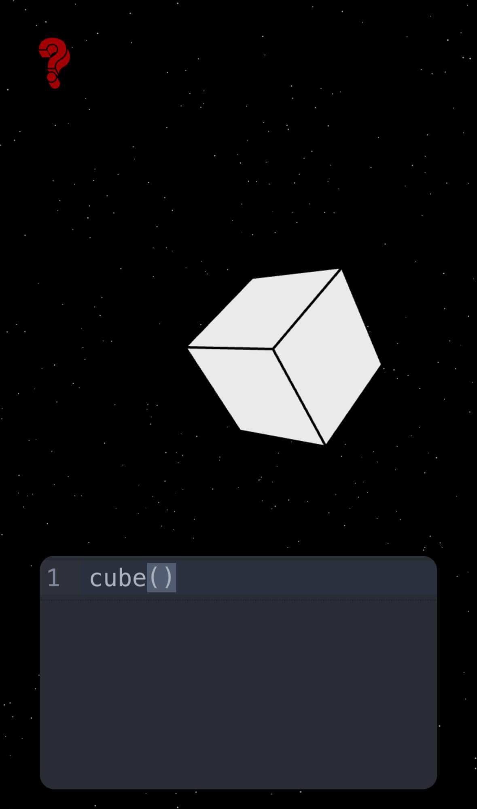

# DSL Doodler

Welcome to **DSL Doodler**, a web-based application that allows users to create and manipulate 3D shapes using a simple domain-specific language (DSL). This project is built with modern web technologies and provides an interactive 3D rendering experience.



## Features

- **3D Shape Creation**: Use a custom DSL to define shapes like cubes and spheres with properties such as size, color, and position.
- **Real-Time Rendering**: Visualize your shapes in a 3D scene powered by `@react-three/fiber`.
- **Interactive Editing**: Click on shapes to edit their properties dynamically.
- **Syntax Validation**: Get instant feedback on your DSL code with linting and error messages.
- **Guide Panel**: Access a built-in guide to learn the DSL syntax.

## Tech Stack

This project leverages the following technologies:

### Frontend

- **React**: For building the user interface.
- **@react-three/fiber**: A React renderer for Three.js to handle 3D rendering.
- **@react-three/drei**: Useful helpers for Three.js.
- **TailwindCSS**: For styling the application.

### Code Editor

- **CodeMirror 6**: A modern code editor with syntax highlighting and linting.
- **@codemirror/lint**: For DSL syntax validation.
- **@codemirror/theme-one-dark**: A dark theme for the editor.

### State Management

- **XState**: A state machine library to manage application logic.

### Build Tools

- **Vite**: A fast build tool for modern web projects.
- **TypeScript**: For type-safe development.

## Getting Started

### Prerequisites

Make sure you have the following installed:

- Node.js (v16 or higher)
- npm or yarn

### Installation

1. Clone the repository:
   ```bash
   git clone https://github.com/your-username/2D-to-3D.git
   cd 2D-to-3D
   ```
2. Install the dependencies:
   ```bash
   npm install
   ```

### Development

Start the development server:

```bash
npm run dev
```

Open your browser and navigate to `http://localhost:5173/` to view the application.

### Build

To build the project for production:

```bash
npm run build
```

### Linting

Run the linter to check for code issues:

```bash
npm run lint
```

## Usage

1. Enter DSL code in the editor panel to define shapes. Example:
   ```dsl
   cube(size=1, color='blue')
   sphere(radius=0.5, x=2, y=1, z=3)
   ```
2. View the shapes rendered in the 3D scene.
3. Click on shapes to edit their properties interactively.

## Contributing

Contributions are welcome! Feel free to open issues or submit pull requests to improve the project.

## License

This project is licensed under the MIT License. See the [LICENSE](LICENSE) file for details.

## Acknowledgments

- [React Three Fiber](https://github.com/pmndrs/react-three-fiber)
- [CodeMirror](https://codemirror.net/)
- [XState](https://xstate.js.org/)

---

Happy Doodling!
